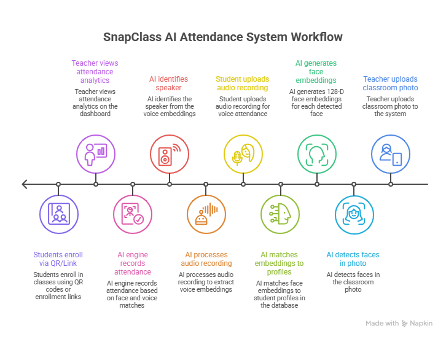

<p align="center">
  
</p>

<h1 align="center">📸 SnapClass</h1>
<h3 align="center">AI-Powered Smart Attendance System</h3>

<p align="center">
  <em>Making classroom attendance faster, smarter, and hands-free using Face &amp; Voice Recognition.</em>
</p>

<p align="center">
  <a href="https://snapclass-mainurl.streamlit.app/"></a>
</p>

<p align="center">
  
  
  
  
  
</p>

---

## 🚀 Overview

**SnapClass** is an AI-powered attendance management system built with Streamlit. It enables teachers to take attendance by simply uploading classroom photos or recording audio — the AI handles the rest using **face recognition** and **voice recognition** pipelines. Students register using FaceID and can optionally enroll their voice for voice-only attendance.

---

## 🔄 System Workflow

<p align="center">
  
</p>

<p align="center"><em>End-to-end workflow: from student enrollment and classroom photo upload to AI-powered face & voice recognition and attendance analytics.</em></p>

---

## ✨ Features

### 👨‍🏫 Teacher Portal
- **Register / Login** with secure password hashing (bcrypt)
- **Create & manage subjects** with subject codes and sections
- **Take attendance via Face Recognition** — upload one or more classroom photos and let the AI detect present students
- **Take attendance via Voice Recognition** — record classroom audio where students say "I am present" and the AI identifies each speaker
- **Share class invite** via a shareable link or auto-generated **QR Code**
- **View attendance records** with session-wise summaries and statistics

### 👩‍🎓 Student Portal
- **FaceID Login** — log in by scanning your face through the webcam (no passwords needed)
- **One-click registration** — new students register with a selfie + optional voice enrollment
- **Enroll in subjects** using subject codes or QR links
- **Quick enrollment** via shareable URL with auto-join support
- **View enrolled subjects** with attendance stats (total classes vs. attended)
- **Unenroll** from subjects anytime

---

## 🧠 AI Pipelines

| Pipeline | Model / Library | How It Works |
|---|---|---|
| **Face Recognition** | `dlib` + `face_recognition_models` + `SVM (scikit-learn)` | Extracts 128-D face embeddings → trains an SVM classifier → matches faces in classroom photos against enrolled students |
| **Voice Recognition** | `Resemblyzer` + `librosa` | Extracts voice embeddings from audio segments → computes cosine similarity against enrolled voice profiles → identifies speakers above a threshold |

---

## 🛠️ Tech Stack

| Layer | Technology |
|---|---|
| **Frontend** | [Streamlit](https://streamlit.io/) — Python-based interactive web UI |
| **Backend / Database** | [Supabase](https://supabase.com/) — PostgreSQL + REST API (BaaS) |
| **Face Detection & Encoding** | [dlib](http://dlib.net/) + [face_recognition_models](https://github.com/ageitgey/face_recognition_models) |
| **Face Classification** | [scikit-learn](https://scikit-learn.org/) (SVM with linear kernel) |
| **Voice Embedding** | [Resemblyzer](https://github.com/resemble-ai/Resemblyzer) |
| **Audio Processing** | [librosa](https://librosa.org/) |
| **Authentication** | [bcrypt](https://pypi.org/project/bcrypt/) — password hashing for teachers |
| **QR Code Generation** | [segno](https://github.com/heuer/segno) |
| **Data Processing** | [NumPy](https://numpy.org/) + [Pandas](https://pandas.pydata.org/) |
| **Image Processing** | [Pillow](https://python-pillow.org/) |

---

## 📂 Project Structure

```
snapclass/
├── app.py                        # Main entry point
├── requirements.txt              # Python dependencies
├── .streamlit/
│   └── secrets.toml              # Supabase credentials (not committed)
│
└── src/
    ├── ui/
    │   └── base_layout.py        # Global styles, fonts & theming
    │
    ├── screens/
    │   ├── home_screen.py        # Landing page — role selection
    │   ├── teacher_screen.py     # Teacher login, dashboard & attendance
    │   └── student_screen.py     # Student FaceID login & dashboard
    │
    ├── components/
    │   ├── header.py             # App header components
    │   ├── footer.py             # App footer components
    │   ├── subject_card.py       # Reusable subject card UI
    │   ├── dialog_create_subject.py
    │   ├── dialog_share_subject.py     # QR code + link sharing
    │   ├── dialog_add_photo.py         # Upload classroom photos
    │   ├── dialog_enroll.py            # Manual subject enrollment
    │   ├── dialog_auto_enroll.py       # Auto-enroll via URL
    │   ├── dialog_attendance_results.py
    │   └── dialog_voice_attendance.py  # Voice-based attendance
    │
    ├── pipelines/
    │   ├── face_pipeline.py      # Face detection, embedding & classification
    │   └── voice_pipeline.py     # Voice embedding & speaker identification
    │
    └── database/
        ├── config.py             # Supabase client initialization
        └── db.py                 # All database CRUD operations
```

---

## ⚡ Quick Start

### Prerequisites

- Python 3.10+
- A [Supabase](https://supabase.com/) project with the required tables

### 1. Clone the repository

```bash
git clone https://github.com/iamhm119/snapclass.git
cd snapclass
```

### 2. Create a virtual environment

```bash
python -m venv venv
source venv/bin/activate        # macOS / Linux
venv\Scripts\activate           # Windows
```

### 3. Install dependencies

```bash
pip install -r requirements.txt
```

### 4. Configure Supabase credentials

Create `.streamlit/secrets.toml`:

```toml
SUPABASE_URL = "https://your-project.supabase.co"
SUPABASE_KEY = "your-anon-or-service-key"
```

### 5. Run the app

```bash
streamlit run app.py
```

The app will open at `http://localhost:8501`.

---

## 🗄️ Database Schema (Supabase)

| Table | Purpose |
|---|---|
| `teachers` | Teacher profiles (username, hashed password, name) |
| `students` | Student profiles (name, face embedding, voice embedding) |
| `subjects` | Subjects/courses (code, name, section, teacher FK) |
| `subject_students` | Many-to-many enrollment linking students ↔ subjects |
| `attendance_logs` | Attendance records (student, subject, timestamp, is_present) |

---

## 🔒 Security

- Teacher passwords are hashed with **bcrypt** before storage
- Supabase credentials are stored in `.streamlit/secrets.toml` (excluded via `.gitignore`)
- Student authentication is **biometric-only** (face recognition) — no passwords to leak

---

## 🤝 Contributing

Contributions are welcome! Feel free to open issues or submit pull requests.

---

## 📄 License

This project is open source and available under the [MIT License](LICENSE).

---

<p align="center">
  Built with ❤️ By Hem 
</p>
